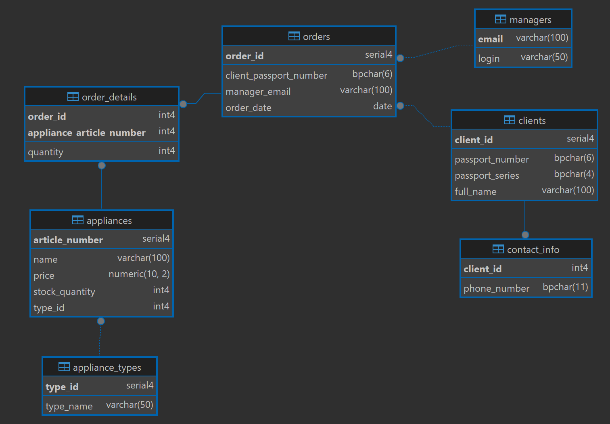

# GUI for working with a database of the subject area "Electrical appliance store"
### Technologies
In this application, I use:
* Java (main language)
* JavaFX for GUI
* CSS for styles
* PostgreSQL for database
* MVC (Model-View-Controller) architectural pattern
### Database structure

